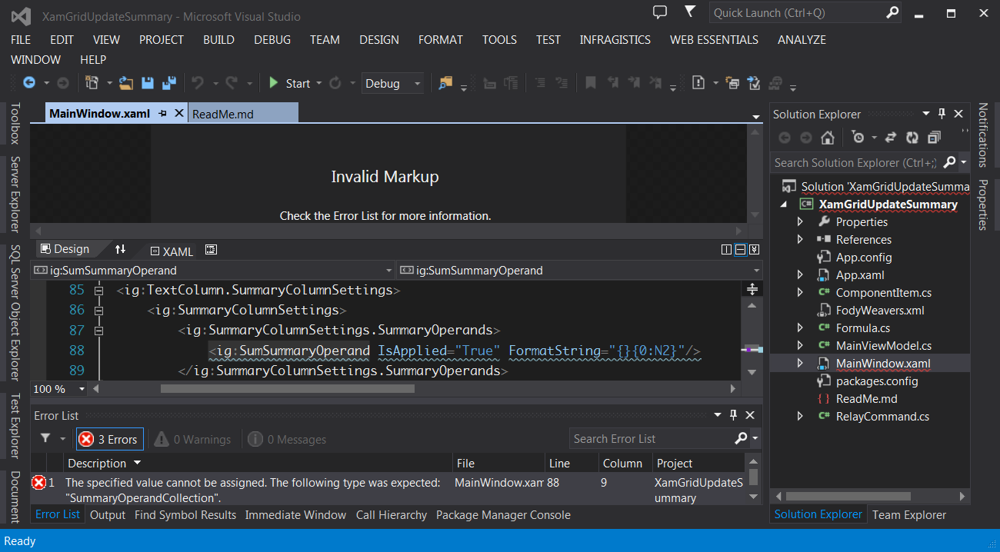

# XamGrid Issues

I created this project intending to ask the following questions from Infragistics, but ultimately solved them before I asked the questions.
I am posting this to help others that may experience challenges with Infragistics XamGrid.

## Resolved Issues

1. Invalid Markup when using SumSummaryOperand in XAML

    I wanted to automatically apply a Sum to a column so I put the following XAML in my file. Unfortunately this
    caused an "Invalid Markup" exception where the Designer would not show any preview.

    Here are the errors:

    a. The specified value cannot be assigned. The following type was expected: `SummaryOperandCollection`.

    b. The member `IsApplied` is not recognized or is not accessible.

    c. The member `FormatString` is not recognized or is not accessible.

    

    **Solution : Add Reference to `InfragisticsWPF4.DataManager.v14.1`**

2. Edit to columns does not change SumSummary

    The grid does not automatically update the Summaries. You have to manually call 'RefreshSummaries'.
    For MVVM application, you will need a reference to the XamGrid or add an Action that will refresh the summaries and use the grid to set the Action. Here is how I accomplished this in this sample using code behind (NOTE: there are many ways to do this with MVVM frameworks, such as Caliburn.Micro you could derive from 'Screen' and access the XamGrid):

    **Solution:**

    ViewModel:

		/// 

		/// HACK: Linking refresh summary from view to view model (MVVM support)
		/// 

		private Action _refreshSummaries = delegate() { };
		public Action RefreshSummaries
		{
			get { return _refreshSummaries; }
			set { _refreshSummaries = value; }
		}

    Code Behind - MainWindow.xaml.cs:

		public MainWindow()
		{
			InitializeComponent();
			Loaded += MainWindow_Loaded;
		}

		void MainWindow_Loaded(object sender, RoutedEventArgs e)
		{
			var vm = DataContext as MainViewModel;
			if (vm != null)
			{
				// HACK: Connecting the view model to refresh the grid summaries
				vm.RefreshSummaries = () =>
				{
					if (FormulaGrid.Rows.Count > 0)
						FormulaGrid.Rows[0].Manager.RefreshSummaries();
				};
			}            
		}

3. Right-click ContextMenu and ActiveItem

    The XamGrid does not update the ActiveItem or ActiveCell or related binding when the user right-clicks on a cell in a different row. The
    solution is to manually update the ActiveCell that triggers the ActiveItem to update as well.

    [Right click context menu post](https://www.facebook.com/notes/infragistics/extending-xamgrid-with-a-right-click-context-menu/10150169172531409)

    **Solution:**

		/// 

		/// Updates the ActiveCell when the right mouse button is pressed
		/// 

		/// <param name="sender"></param>
		/// <param name="e"></param>
		private void Cell_MouseRightButtonDown(object sender, MouseButtonEventArgs e)
		{
			var pos = e.GetPosition((IInputElement)sender);
			var cell = (CellControl)sender;
			var parent = (CellsPanel)cell.Parent;
			var data = parent.Row.Data;
			if (FormulaGrid.ActiveCell != cell.Cell)
				FormulaGrid.ActiveCell = cell.Cell;
			Trace.TraceInformation("MouseRightButtonDown: ({0}, {1}), ActiveCell: {2}", pos.X, pos.Y, FormulaGrid.ActiveCell);
		}

## Outstanding Issues

1. Move Up / Move Down causes the ActiveCell to change to the first cell in the row

2. Change above solutions to be more MVVM friendly, e.g. write Behaviors for the same functionality
