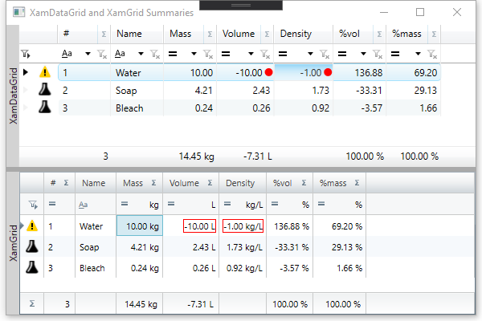

# XamDataGrid (and XamGrid) Summaries Example

I created this project intending to ask the following questions from Infragistics, but ultimately solved them before I asked the questions.
I am posting this to help others that may experience challenges with Infragistics `XamGrid`.
I started with Infragistics WPF v14.1 and eventually upgraded to v20.1.

This project was originally for `XamGrid`, but now includes `XamDataGrid` since that is the primary focus going forward. The `XamGrid` still has an issue with summaries where it needs to be manually refreshed when a value involved in the summary changes. I used a code-behind hack to solve this back in 2014 and it looks like it is still necessary.

## Overview

This project is a simple formula (recipe or batch) calculator for percentage mass and percentage volume. The density is used to convert
between mass and volume, and then calculate the mass and volume percentages for each component, and finally for the overall formula.



## Outstanding Issues

1. In XamDataGrid, figure out how to right align the summary cells. It is possible to override the default style, but that causes all summary cells to be affected and not just specific cells.

2. In XamDataGrid, connect the context menu for the rows, and a different context menu for the header. (I started with XamGrid, so it was implemented there first.)

3. In XamDataGrid, figure out how to remove summary functions from the available list. This was easy with XamGrid, but I have not figured it out yet in XamDataGrid.

## XamGrid Resolved Issues

1. `Invalid Markup` when using SumSummaryOperand in XAML

    I wanted to automatically apply a Sum to a column so I put the following XAML in my file. Unfortunately this
    caused an `Invalid Markup` exception where the Designer would not show any preview.

    Here are the errors:

    a. The specified value cannot be assigned. The following type was expected: `SummaryOperandCollection`.

    b. The member `IsApplied` is not recognized or is not accessible.

    c. The member `FormatString` is not recognized or is not accessible.

    

    **Solution : Add Reference to `InfragisticsWPF4.DataManager.v14.1`**

2. Editing column value does not change SumSummary

    The grid does not automatically update the Summaries. You have to manually call 'RefreshSummaries'.
    For MVVM application, you will need a reference to the XamGrid or add an Action that will refresh the summaries and use the grid to set the Action. Here is how I accomplished this in this sample using code behind (NOTE: there are many ways to do this with MVVM frameworks, such as Caliburn.Micro you could derive from 'Screen' and access the XamGrid):

    **Solution 1: Automatically update summary after cell edit**

    [Update summary values in response to cell edit](http://www.infragistics.com/community/blogs/kiril_matev/archive/2010/05/21/understanding-advanced-summaries-in-the-xamwebgrid.aspx)

    > ## Updating summary values in response to cell edit
    > Please edit any of the values in the Units column and note that the summary value is updated in response to that. Automatic updates of summary values are not built-in for performance reasons. In order to setup the XamGrid to update the summary value, handle the CellExitedEditMode event, and in the handler, invoke the InvalidateData member of the XamGrid. This would cause the XamGrid to regenerate the summary values to reflect the edit operation.


    **Solution 2: Manually call RefreshSummaries from ViewModel**

    ViewModel:

```C#
		/// <summary>
		/// HACK: Linking refresh summary from view to view model (MVVM support)
		/// </summary>
		private Action _refreshSummaries = delegate() { };
		public Action RefreshSummaries
		{
			get { return _refreshSummaries; }
			set { _refreshSummaries = value; }
		}
```

    Code Behind - MainWindow.xaml.cs:

```C#
		public MainWindow()
		{
			InitializeComponent();
			Loaded += MainWindow_Loaded;
		}

		void MainWindow_Loaded(object sender, RoutedEventArgs e)
		{
			var vm = DataContext as MainViewModel;
			if (vm != null)
			{
				// HACK: Connecting the view model to refresh the grid summaries
				vm.RefreshSummaries = () =>
				{
					if (FormulaGrid.Rows.Count > 0)
						FormulaGrid.Rows[0].Manager.RefreshSummaries();
				};
			}
		}
```

3. Right-click ContextMenu and ActiveItem

    The XamGrid does not update the ActiveItem or ActiveCell or related binding when the user right-clicks on a cell in a different row. The
    solution is to manually update the ActiveCell that triggers the ActiveItem to update as well.

    [Right click context menu post](https://www.facebook.com/notes/infragistics/extending-xamgrid-with-a-right-click-context-menu/10150169172531409)

    **Solution:**

```C#
		/// <summary>
		/// Updates the ActiveCell when the right mouse button is pressed
		/// </summary>
		/// <param name="sender"></param>
		/// <param name="e"></param>
		private void Cell_MouseRightButtonDown(object sender, MouseButtonEventArgs e)
		{
			var pos = e.GetPosition((IInputElement)sender);
			var cell = (CellControl)sender;
			var parent = (CellsPanel)cell.Parent;
			var data = parent.Row.Data;
			if (FormulaGrid.ActiveCell != cell.Cell)
				FormulaGrid.ActiveCell = cell.Cell;
			Trace.TraceInformation("MouseRightButtonDown: ({0}, {1}), ActiveCell: {2}", pos.X, pos.Y, FormulaGrid.ActiveCell);
		}
```

## Outstanding Issues

1. Move Up / Move Down causes the ActiveCell to change to the first cell in the row

2. ~~Right-click context menu on the grid shows the same context menu everywhere on the grid, including header and summary rows.~~

3. Change above solutions to be more MVVM friendly, e.g. write Behaviors for the same functionality
